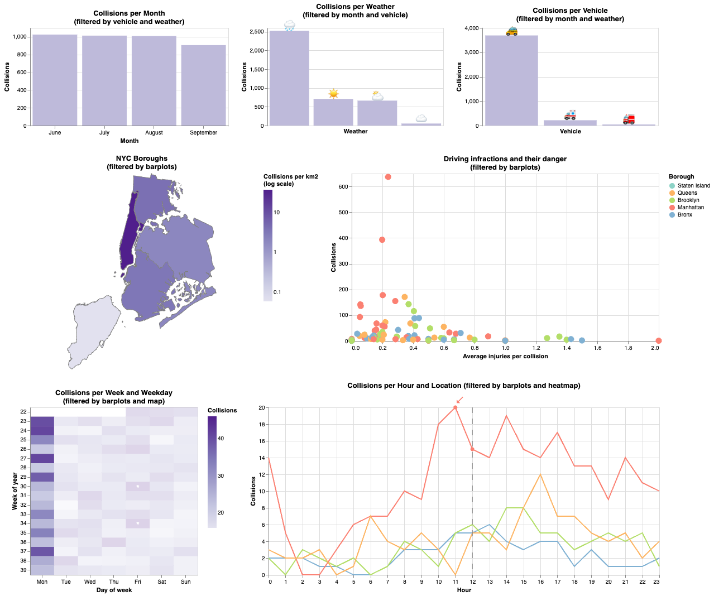

# Interactive Collisions in New York City

Goal is to answer the following questions with adequate visualisations:
* Which weather condition and type of vehicle were present in the majority of accidents each month? And in the combination of all the months?
* In which area and at what hour did the majority of accidents each month happen? And in the combination of all the months?
* Which area presented the majority of taxi accidents during rainy days in June on Mondays at noon, 12am?
* Which day had more accidents during clear days in July in Manhattan?

## Data
We used clean data from our previous [static visualization](../interactive_vis/) as well as [weather data](./original-data/weather2018.csv) provided by our professors.

## Final Visualization

  

