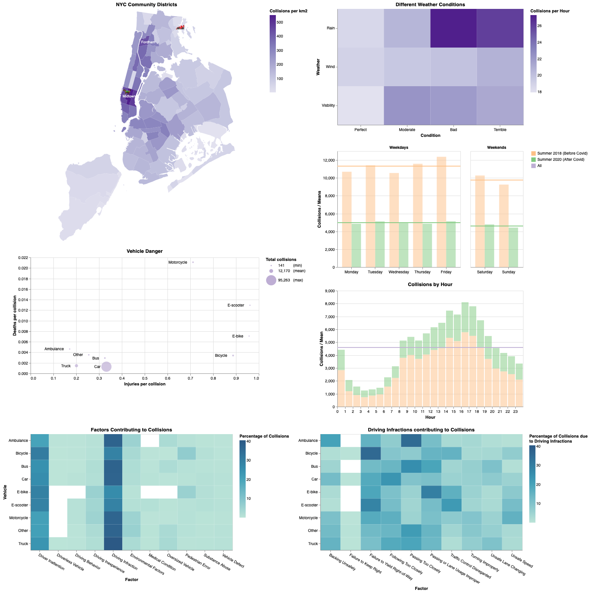

# Collisions in New York City

Goal is to answer the following questions with adequate visualisations:
* Are accidents more frequent during weekdays or weekends? Is there any difference between before COVID-19 and after?
* Is there any type of vehicle more prone to participate in accidents?
* At what time of the day are accidents more common?
* Are there any areas with a larger number of accidents?
* Is there a correlation between weather conditions and accidents?

## Data
* Jun-Sep 2018 & Jun-Sep 2020 rows from the [NYC collision dataset](https://data.cityofnewyork.us/Public-Safety/Motor-Vehicle-Collisions-Crashes/h9gi-nx95). Find the dataset in a _csv_ format already filtered by date [here](./original-data/collisions.csv).
* Map from [NYC community district boundaries](https://data.cityofnewyork.us/City-Government/Community-Districts/yfnk-k7r4).
* Community district labels from [this pdf](https://furmancenter.org/files/sotc/SOC2007_IndexofCommunityDistricts_000.pdf).

## Final Visualization

  

